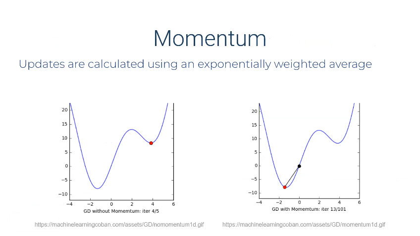
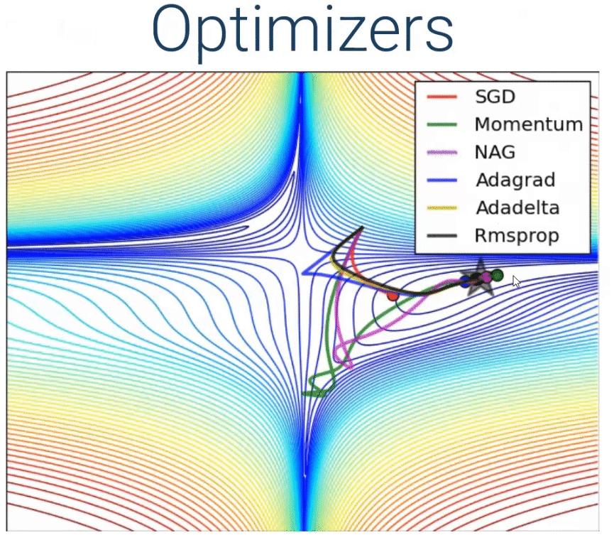

# Optimizers

Optimization is the task of minimizing/maximizing an objective function. With deep learning the objective function is the loss/error/cost function and you and you want to find the parameters $\theta$ that significantly reduce the cost function  $J(\theta)$

**Optimization algorithms** find the lowest possible value of the objective function. 

## Gradient decent 

With a single function it is like below:

But it is in higher dimension. 

In math it is like this: 

$\theta_{n+1} = \theta_{n} - \eta \cdot \Delta_{\theta}J(\theta)$

The new parameters ($\theta_{n+1}$) are the current parameters ($\theta_{n}$) minus the derivative of the loss function ($\Delta_{\theta}J(\theta)$). The loss function which takes the parameters is ($J(\theta)$). You also multiply the derivative by the learning rate to scale back changes so you don't learn too fast and overshoot or too slow and never get there. 

- $\theta$ is a parameter. A weight, bias or activation for example
- $\eta$ is the learning rate. Sometimes $\alpha$ or $\gamma$ is used
- J is formally known as the objective function (cost/error/loss function)

We take the parameter $\theta$ and update it by taking the original parameter $\theta$ and subtract the learning rate times the ratio of change $\Delta J(\theta)$

### 3 ways to apply gradient decent

- (Vanilla/Batch) gradient decent
- Mini Batch Gradient descent
- Stochastic Gradient Descent

#### Vanilla/Batch gradient descent 
With this gradient descent you calculate the derivative with all the data.

So lets say you have 1000 images. You feed them trough the network to get the result. Then you calculate the loss for each image and each parameter. Then you add them all together and make the changes. 

**Advantages**

- Straight forward trajectory towards minimum 
- Unbiased estimate of the gradient 

**Limitations**

- May be to slow to go over all the examples 
- You can run out of memory
- Some examples might be redundant

#### Mini Batch Gradient descent

With mini batch you run the model over batches of your dataset and then calculate the gradient for each input in the batch add them together to get a weights adjustment for one batch. Then you do this for all the batches. Either you adjust the parameters after batch or you add the adjustment for each batch together to get the adjustment to the parameters. 

The size of the batch is a hyper parameter.

**Advantages**

- Faster than normal gradient descent
- Adds noise (improves generalization)
	- Kind of a way of generalization 

**Disadvantages**

- Learning steps have oscillations 
- Doesn't converge (Wanders around minimum)

Mini batch is the one mostly used. 

#### Stochastic Gradient Descent

Stochastic gradient descent is the extreme of the **mini batch with batch size = 1**. Update the model after each example.

With the other gradient decent you combine the gradients of the inputs to make one update to the weights. With stochastic gradient descent you don't do this and update the parameters after each input. This might cause updates to go against each other as well. 

**Advantage**

- More noisy => improves generalization 

**Limitations 

- Increases runtime
- Variance becomes large

### Problems of Gradient Descent

- **Local minima** - With gradient descent you might get stuck in a local minima.
- Choosing a propper learning rate can be difficult
- The same learning rate applies to all parameter updates 

### Resolving problems with Gradient Descent

#### Local minima
To solve the local minima problem you can use [[exponentially weighted averages]] to do **momentum gradient descent**. Instead of applying the gradient descent directly you apply the exponentially weighted average with the gradients applied before.

**Momentum**: $\theta_{t+1}=\theta_{t}-\alpha v(t)$ 
$v(t)=\beta v(t-1)+(1-\beta)\Delta_{\theta}J(\theta_{t})$ 

Now this causes the gradient movement to oscillate less because if the previous gradient was in the opposite direction it will pull back the current one. 

This comes with 2 hyper parameters $\alpha$ = learning rate and $\beta$ = control of exponentially weighted average.  You can also see in the image that the first move is the same between steps because at the first one there is no previous to take into account.

With momentum it is able to find the global minima because it takes into account the previous large movement downwards.

You also have **Nesterov Accelerated Momentum** which has this formula instead: $\theta_{t+1} = \theta_{t} - \alpha v(t)$ 
$v(t) = \mu v(t-1) + \Delta_{\theta}J(\theta_{t} - \mu v(t-1))$

Here $\mu$ is the momentum. The idea is that you calculate the current momentum based on the previous momentum instead of the previous gradient. 

This is called momentum because its like a ball rolling down a hill has momentum and if it has enough momentum it can roll over and out of a local minima.

**A pro of momentum is** you have faster convergence than traditional SGD. It moves faster because the momentum which it accumulates. 

**Con**: You can have way too much momentum and swing back and forth between local minima or miss the local minima. Same problems already present with learning rate.

### Adaptive learning rates
You can have different learning rates for different parameters. 

#### AdaGrad

Adagrad uses a different learning rate for each parameter $\theta_{i}$ . 

- Smaller learning rate for parameters associated with frequent features 
- Larger learning rates for parameters associated with infrequent features. 

Frequent here is defined by how often a feature occurs. 

This works well on sparse data and improves the robustness of SGD.

So remember with the learning rate you multiply the learning rate with the adjustment you calculated to the parameters (the gradient) g. For the math we need the gradient in two 
places so lets call it g:

$$g_{t,i}=\Delta_{\theta}J(\theta_{t,i})$$
So the parameter update is is done like this: $$\theta_{t+1,i} = \theta_{t,i} - \frac{\eta}{\delta+\sqrt{r_{t,i}}}\cdot g_{t,i}$$
So the next parameter (t+1) for each parameter (i) is the gradient you calculated - the learning rate for that parameter $\times$ the gradient.  So we calculate the learning rate by that parameter by dividing the global learning rate we decided on by $\delta + \sqrt{r_{ti}}$ . r here is: $$r_{t,i}=r_{t-1,i}+g_t^2$$
So r is the previous r for that parameter plus the gradient to the power 2 (to make it positive). So r never goes down it only increases. Remember the i indicates that this is done separately for every r. So you have different r and learning rate for each parameter.  

The more gradient you get the bigger the r is going to get. Because it is in the lower part of the division of the learning rate it will reduce the learning rate more and more. 

**advantage** - With Adagrad you don't have to tune the learning rate
**Limitation** - The sum of squared gradients for some parameter may cause a too fast decrease in the learning rate and cause learning to go to slow.  (this is why we have the $\delta$ parameter to midigate against this but also to avoid dividing by 0 )

### RMSprop

This method overcomes the issue that AdaGrad has of the continuously decreasing learning rate. Adagrad uses accumulating gradient squares. RMSProp uses a moving average. This is the math:

$$\theta_{t+1,i}=\theta_{t,i}-\frac{\eta}{\sqrt{r_{t,i}+\epsilon}}g_{t,i}$$
So now instead of dividing by r you divide by this $r + \epsilon$ the $r$ is done like this:
$$r_{t,i}=\Upsilon r_{t-1,i}+(1-\Upsilon)r_{t,i}$$

This is just the **same as the  [exponentially weighted averages](exponentially%20weighted%20averages.md) from momentum**. Except now they renamed $\beta$ to $\Upsilon$. The $\epsilon$ is there to keep things going to 0. So now you use momentum in the learning rate to prevent it going crazy too fast.

### Adam
The last optimizer which is very popular is Adam. It also incorporates momentum in the gradient descent step. So you have as update rule: 
$$\theta_{t+1,i} = \theta_{t,i}-\frac{\eta}{\sqrt{\hat{v}_{t,i}}+\epsilon}\hat{m}_{t,i}$$

So here instead of $g$ we have $\hat{m}$ to compute the changes to the weights which stands for momentum. $m$ is given by: 
$$m_{t,i} = \beta_{1}m_{t-1,i}+(1-\beta_{1)}g_{t,i}$$
And $v$ to update the learning rate is given by:
$$v_{t,i} = \beta_{2}v_{t-1,i}+(1-\beta_{2})g^2_{t,i}$$
So basically it does momentum with the gradient and the learning rate. So we have have one $\beta$ for gradient and one for learning rate. 

But that is $m$ and not $\hat{m}$ and $\hat{v}$ instead of $v$ so how do we get to hat m and v?

$$\hat{m}_{t,i} = \frac{m_{t,i}}{1-\beta^{t_{1}}}~~~~~~~~~~~~\hat{v}_{t,i}=\frac{v_{t,i}}{1-\beta^t_2}$$

So you divide the v and m by 1 - (their beta). This is done as a correction to reduce bias towards 0 at the beginning of the training. The idea of the correction is to ignore the past at the beginning. That effect stops because 1-b does not change the devision only has impact at the start. See the image below.

#### Default values of Adam
- $\eta=0.001$
- $\beta_{1}=0.9$ 
- $\beta_{2}=0.999$ 
- $\epsilon=1e^{-8}$ 

Adam is basically the best solver. 

### Other optimizers

- Adadelta: exstends Adagrad
- Adamax: exstends Adam
- Nadam: Combines Adam and Nesterov

## Implementations 

There are many implementations of optimizers.

